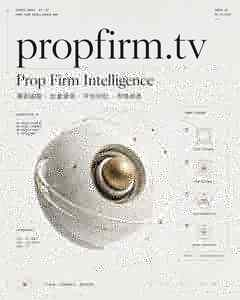
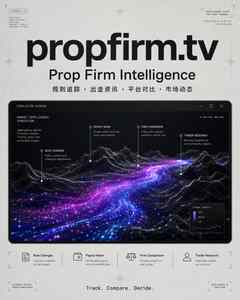
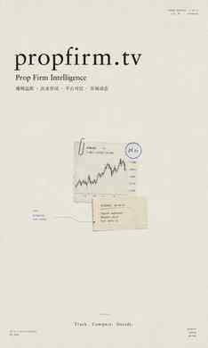
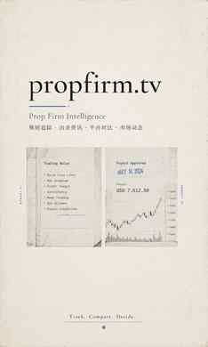
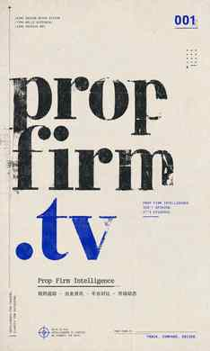
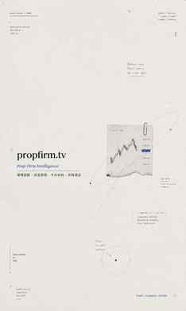

# Kimi Design Refer

> 一个可被 Agent 直接调用的 **Kimi-inspired Quiet Computational Design System**，并扩展了一层克制的 **Zine Editorial** 视觉语言。
>
> **Unofficial. Not affiliated with Kimi / Moonshot AI.**

`kimi-design-refer` 不是一条固定 Prompt，也不是只会生成某一种海报的模板。

它是一层 **Design Reference / Style Router**：让 Codex、Cursor、Trae、OpenHands 或其他支持 Agent Skills / 本地指令文件的 Agent，在设计网站、PPT、PDF、海报、社交媒体图片、信息图与动态视觉时，先加载同一套视觉语言，再完成具体任务。

当前系统包含：

- **7 个 Kimi Core Families**：偏计算、研究、证据、实验与技术叙事；
- **5 个 Zine Editorial Families**：偏纸张、档案、极端留白、印刷与诗性编辑；
- **6 种 Medium Routes**：Web、PPT/PDF、Poster、Infographic、Motion、Review；
- **Kimi × Zine Blend**：允许一个 Core Family 与一个 Zine Family 按强度融合。

---

## Visual System at a glance

下面这组 Benchmark 使用**完全相同的 PropFirm.TV 文案**，只切换视觉家族，用来观察 12 个 Family 的差异。


---

## Design Equation

Kimi Design Refer 的基础公式是：

```text
quiet field
+ bounded evidence system
+ technical hierarchy
+ visible process
+ restrained anomaly
```

可以理解为：

> **一个安静的大场域 + 一个受控的信息事件 + 清晰的技术层级 + 可见的思考过程 + 一个克制的异常点。**

它刻意避免把「AI 感」理解成蓝紫渐变、发光大脑、玻璃卡片、赛博城市和满屏节点。

这里更强调：

- 大面积留白；
- 一个主视觉事件；
- 轨道、测量、索引、点云、证据、状态变化等 reasoning traces；
- 微型注释与编号；
- 黑 / 白 / 灰为基础的克制颜色体系；
- 过程感，而不是纯装饰。

---

## What this Skill can do

适合让 Agent：

- 设计 **Website / Landing Page / Product UI**；
- 设计 **PPT / PDF / Research Deck**；
- 生成 **Poster / Social Graphic / Article Cover**；
- 构建 **Infographic / Diagram / Data Visual**；
- 定义 **Motion / Hero Animation / Launch Visual**；
- 用 `review-only` 模式充当轻量级 **Art Director**，审查已有设计。

---

# 12 Visual Families

## 7 Kimi Core Families

| Family | 中文 | 核心视觉 | 适合 |
| --- | --- | --- | --- |
| `black-orbit` | 黑域轨道 | 黑色场域、巨大轨道 / 膜结构、细线节点 | Agent Network、生态、协作、系统 |
| `pixel-moon` | 像素登月 | 黑白像素、Dither、月球 / 入口、低比特界面 | 开源、开发者、探索、Builder Culture |
| `white-lab` | 白场实验室 | 冷白实验场、测量工具、点云、等高线 | 研究、工具、模型架构、分析流程 |
| `cosmic-index` | 宇宙索引 | 浅色知识场、天体标本、索引、Serif + Mono | 研究发布、知识、模型、报告 |
| `gray-proofboard` | 灰域证据板 | 中灰场、一个证据碎片、`001 /`、微注释 | 产品能力、案例、规则、研究结论 |
| `kinetic-glyph` | 字符变形 | 一个符号在笔触 / 粒子 / 几何之间变化 | Slogan、版本发布、抽象概念 |
| `simulation-window` | 模拟窗口 | 单一高信息彩色窗口 + 安静单色外壳 | 数据模拟、3D、Demo、动态结果 |

### Core Family Gallery

| `black-orbit` | `pixel-moon` |
| --- | --- |
|  |  |

| `white-lab` | `cosmic-index` |
| --- | --- |
|  |  |

| `gray-proofboard` | `kinetic-glyph` |
| --- | --- |
|  |  |

| `simulation-window` |
| --- |
|  |

### Core Family 的共同底层

```text
极端场域对比
+ 单一生成系统
+ 受控的信息密度
+ 技术层级
+ 一个异常点
+ 过程 > 装饰
```

---

## 5 Zine Editorial Extension Families

Zine Extension 不是把所有 Kimi 设计都变成「旧纸风」。

它是一层可选的编辑语言，用于引入：

- 70%–90% 的极端留白；
- 一个很小的视觉事件；
- 纸张、扫描、Xerox、Risograph、Halftone 等 reproduction language；
- 稀疏的 Serif / Mono / Typewriter typography；
- 一个清晰的高饱和色锚点。

| Family | 中文 | 核心视觉 | 适合 |
| --- | --- | --- | --- |
| `zine/micro-archive` | 微型档案 | 80% 左右留白 + 一个小型档案证据 | 研究封面、观点、规则记录 |
| `zine/dual-memory` | 双联记忆 | 两个小画面形成前后 / 对比关系 | Signal vs Noise、前后变化、双状态 |
| `zine/color-cutout` | 色块剪贴 | 图像碎片 + 一个强烈高饱和色块 | Campaign、事件、冲突、重点信息 |
| `zine/type-relic` | 文字遗物 | Typography 本身成为主视觉标本 | Slogan、章节页、品牌声明 |
| `zine/orbit-notes` | 漂移注记 | 小主体 + 远距离注释 / 日期 / 坐标 | 研究笔记、地图、技术叙事 |

### Zine Extension Gallery

| `zine/micro-archive` | `zine/dual-memory` |
| --- | --- |
|  |  |

| `zine/color-cutout` | `zine/type-relic` |
| --- | --- |
|  |  |

| `zine/orbit-notes` |
| --- |
|  |

---

# Kimi × Zine Blending

一个设计可以：

1. 只使用一个 **Kimi Core Family**；
2. 只使用一个 **Zine Editorial Family**；
3. 使用 **一个 Core + 一个 Zine** 进行融合。

不要平均混合所有家族。

推荐的融合强度：

```text
zine-light    15–25%
zine-medium   30–45%
zine-full     60–80%
```

例如：

```text
Use $kimi-design-refer.

Medium: poster-social
Core family: gray-proofboard
Zine family: zine/micro-archive
Zine intensity: medium

Make a research poster for PropFirm.TV.
```

得到的不是纯数字证据板，也不是纯独立杂志，而是：

> **Kimi 的理性、计算、证据感 + Zine 的纸感、档案感、诗性留白。**

---

# Supported Mediums

调用 Skill 时，可以声明一个主媒介：

```text
web-ui
ppt-pdf
poster-social
infographic
motion
review-only
```

### `web-ui`

适合网站、Landing Page、产品页与 Dashboard。

优先保证真实 UI 可用性、HTML/CSS 文本可读性，再应用大场域、编号章节、证据窗口和克制交互。

### `ppt-pdf`

适合研究报告、机构资料、发布 Deck。

重点不是逐页随机换风格，而是建立一条贯穿 Title → Chapter → Evidence → Data → Closing 的视觉主线。

### `poster-social`

适合海报、公众号封面、小红书、社交媒体视觉。

应把内容收敛成：

```text
一个命题
+ 一个视觉事件
+ 一个明确 Family
```

### `infographic`

准确性优先于艺术性。

能用 HTML / SVG / Vector / Editable Layout 表达的文字与数据，不应该全部交给图片模型随机绘制。

### `motion`

先选一个 Motion Verb：

```text
orbit
converge
calibrate
reveal
index
dissolve
simulate
```

然后让动作继承静态视觉系统，而不是单独做一套「炫技动效」。

### `review-only`

让 Skill 作为 Art Director 审查已有作品，检查：

- Family fidelity；
- Negative-space discipline；
- Hierarchy；
- Reasoning trace；
- Color restraint；
- Originality；
- Readability。

优先输出最值得改的 3 个问题。

---

# Installation

## Codex / Compatible Agent Skills

```bash
git clone https://github.com/78tyih/kimi-design-refer.git \
  ~/.codex/skills/kimi-design-refer
```

如果 Skill 没有立即出现，重启 Agent 环境。

对于 Cursor、Trae、OpenHands 或其他 Agent，也可以把仓库放进其可读取的 Skill / Rules / Instructions 路径，并让 Agent 加载 `SKILL.md`。

---

# Basic Usage

## 直接指定 Family

```text
Use $kimi-design-refer.

Medium: web-ui
Family: black-orbit

Design a homepage for an AI trading intelligence platform.
```

## 让 Agent 自动选择 Family

```text
Use $kimi-design-refer as the visual reference system.

Medium: poster-social

Read the brief, choose the most appropriate visual family,
and explain the family choice before generating the final design.
```

## Kimi × Zine

```text
Use $kimi-design-refer.

Medium: poster-social
Core family: cosmic-index
Zine family: zine/orbit-notes
Zine intensity: light

Create a research poster about AI trading systems.
```

## Review Existing Design

```text
Use $kimi-design-refer.

Medium: review-only
Family target: gray-proofboard

Review this design.
Score family fidelity, negative space, hierarchy,
reasoning trace, color discipline and readability.
Return the top 3 changes with the highest visual impact.
```

---

# PropFirm.TV Benchmark

为了验证 Family 的差异，我们用同一份 brief 做了 12 张海报。

```text
Brand: propfirm.tv
Subtitle: Prop Firm Intelligence
Chinese line: 规则追踪 · 出金资讯 · 平台对比 · 市场动态
Tagline: Track. Compare. Decide.
```

12 个 Family 的完整可复制 Prompt 放在：

**[`examples/propfirm-tv-benchmark.md`](./examples/propfirm-tv-benchmark.md)**

这份文件既可以作为 Benchmark 复现说明，也可以作为今后调用 Skill 的 Prompt Cookbook。

---

# Recommended Family Selection

如果暂时不知道选哪个，可以先按这个规则：

- **研究 / 对比 / 证据页** → `gray-proofboard`
- **产品解释 / 分析工具 / Strategy Deck** → `white-lab`
- **知识系统 / 地图 / Research Narrative** → `cosmic-index`
- **Agent / Network / Infrastructure** → `black-orbit`
- **Builder / Open Source / Experimental** → `pixel-moon`
- **Brand Statement / Launch / Slogan** → `kinetic-glyph`
- **Simulation / Demo / Generated Output** → `simulation-window`
- **极度克制的研究封面** → `zine/micro-archive`
- **两种状态 / 前后对照** → `zine/dual-memory`
- **需要一个强 Campaign 焦点** → `zine/color-cutout`
- **字体本身就是主视觉** → `zine/type-relic`
- **研究笔记 / 坐标 / 注释感** → `zine/orbit-notes`

---

# Design Boundaries

这个仓库刻意避免：

- 声称是官方 Kimi / Moonshot Brand Kit；
- 复制 Kimi 官方 Logo、Campaign Lockup 或专有素材；
- 复刻某一张参考作品的精确构图；
- 把所有 Family 混在一起；
- 把「AI 风格」退化成蓝紫渐变、Glassmorphism、Neon、Cyberpunk；
- 用无意义 Microtext 和节点把画面塞满。

原则是：

> **Preserve the system, not the sample residue.**

学习的是视觉语法，而不是复制作品身份。

---

# Repository Structure

```text
kimi-design-refer/
├── SKILL.md
├── README.md
├── THIRD_PARTY_NOTICES.md
│
├── assets/
│   └── benchmark/
│       ├── visual-benchmark-grid.jpg
│       ├── black-orbit.jpg
│       ├── pixel-moon.jpg
│       ├── white-lab.jpg
│       ├── cosmic-index.jpg
│       ├── gray-proofboard.jpg
│       ├── kinetic-glyph.jpg
│       ├── simulation-window.jpg
│       ├── zine-micro-archive.jpg
│       ├── zine-dual-memory.jpg
│       ├── zine-color-cutout.jpg
│       ├── zine-type-relic.jpg
│       └── zine-orbit-notes.jpg
│
├── examples/
│   └── propfirm-tv-benchmark.md
│
├── references/
│   ├── philosophy.md
│   ├── style-families.md
│   └── zine-editorial-extension.md
│
└── agents/
```

---

# Acknowledgements

Kimi Design Refer 是一个 **original, unofficial visual reference system**。

它参考并重新组织了两个公开、MIT-licensed 项目中的高层设计系统思路：

- [`Fannie0715/kimi-inspired-poster`](https://github.com/Fannie0715/kimi-inspired-poster)
- [`LiamGvchi/gc-minimal-zine-poster`](https://github.com/LiamGvchi/gc-minimal-zine-poster)

其中第二个项目启发了极端留白、单一小型视觉事件、稀疏编辑字体、单一高饱和色锚点与 print / scan reproduction 等机制；这些机制在本仓库中被重新组织为 5 个可与 Kimi Core 协同工作的 Zine Editorial Extension Families。

详见：[`THIRD_PARTY_NOTICES.md`](./THIRD_PARTY_NOTICES.md)

---

## Source & Rights Note

本仓库不包含、也不声称拥有 Kimi / Moonshot 的官方品牌资产。

第三方灵感来源继续遵循其原始许可证与归属要求。Benchmark 图片用于展示本 Skill 的视觉家族行为，不代表 Kimi / Moonshot 官方设计或背书。
